# Interim Report
## Insurance Risk Analytics & Predictive Modeling

**Project**: AlphaCare Insurance Solutions (ACIS) - Risk Analytics  
**Status**: Tasks 1 & 2 Complete

---

## Executive Summary

This interim report summarizes the progress made on the Insurance Risk Analytics project for AlphaCare Insurance Solutions. The project aims to develop cutting-edge risk and predictive analytics for car insurance planning and marketing in South Africa. This report covers the completion of Task 1 (Git & GitHub + EDA & Statistics) and Task 2 (Data Version Control with DVC).

### Key Achievements

- ✅ **Task 1**: Comprehensive Exploratory Data Analysis (EDA) completed with actionable insights
- ✅ **Task 2**: Reproducible data pipeline established using Data Version Control (DVC)
- ✅ **Code Quality**: CI/CD pipeline configured with automated code quality checks
- ✅ **Documentation**: Comprehensive documentation and reports created

---

## 1. Task 1: Git & GitHub + EDA & Statistics

### 1.1 Git and GitHub Setup

#### Repository Structure
- **Repository**: `insurance-risk-analytics`
- **Main Branch**: `main` (with merged work from task-1 and task-2)
- **Branches Created**: `task-1`, `task-2`
- **Total Commits**: 10+ commits with descriptive messages
- **CI/CD Pipeline**: Configured with GitHub Actions

#### Version Control Practices
- ✅ Proper branching strategy implemented
- ✅ Regular commits with descriptive messages (minimum 3 per day requirement met)
- ✅ Pull Request workflow established
- ✅ Code quality checks automated (black, isort, flake8)

#### CI/CD Pipeline
- **Workflow File**: `.github/workflows/ci.yml`
- **Checks Configured**:
  - Code quality (flake8)
  - Code formatting (black)
  - Import sorting (isort)
  - Notebook format validation
  - Test execution pipeline

### 1.2 Exploratory Data Analysis (EDA)

#### Dataset Overview
- **Total Records**: 1,338
- **Total Columns**: 7
- **Data Quality**: No missing values, no duplicates
- **Time Period**: Historical insurance data

**Note on Financial Variables**: This dataset contains insurance charges as the primary financial metric. In a typical insurance analysis, we would separately analyze TotalPremium (premiums collected) and TotalClaims (claims paid) to calculate Loss Ratio (TotalClaims/TotalPremium). For this dataset, charges represent the total insurance costs billed. Where applicable, we analyze charges as a proxy for understanding risk and profitability patterns.

#### Key Variables Analyzed
- **Demographics**: Age, Gender (sex), BMI, Number of children
- **Behavioral**: Smoker status
- **Geographic**: Region (northeast, northwest, southeast, southwest)
- **Financial**: Charges (insurance costs - represents total billed amounts)

#### Data Summarization

**Descriptive Statistics for Financial Variables**:

**Charges (Insurance Costs)**:
- **Mean**: $13,270.42
- **Median**: $9,382.03
- **Standard Deviation**: $12,110.01
- **Minimum**: $1,121.87
- **Maximum**: $63,770.43
- **Range**: $62,648.56
- **Variance**: $146,652,420.20
- **Q1 (25th percentile)**: $4,740.29
- **Q3 (75th percentile)**: $16,639.91
- **IQR (Interquartile Range)**: $11,899.63
- **Skewness**: 1.52 (right-skewed)
- **Kurtosis**: 1.61
- **Coefficient of Variation**: 0.91 (91%)

**Note**: This dataset contains insurance charges (medical costs) as the primary financial metric. In a typical insurance dataset, we would analyze TotalPremium (premiums collected) and TotalClaims (claims paid) separately. For this analysis, charges represent the total insurance costs, which can be interpreted as a combination of premium and claim costs.

**Complete Descriptive Statistics Table**:

| Statistic | Age | BMI | Children | Charges |
|-----------|-----|-----|----------|---------|
| **Count** | 1,338 | 1,338 | 1,338 | 1,338 |
| **Mean** | 39.21 | 30.66 | 1.09 | $13,270.42 |
| **Median** | 39.00 | 30.40 | 1.00 | $9,382.03 |
| **Std Dev** | 14.05 | 6.10 | 1.21 | $12,110.01 |
| **Min** | 18.00 | 15.96 | 0.00 | $1,121.87 |
| **Max** | 64.00 | 53.13 | 5.00 | $63,770.43 |
| **Q1** | 27.00 | 26.30 | 0.00 | $4,740.29 |
| **Q3** | 51.00 | 34.69 | 2.00 | $16,639.91 |
| **IQR** | 24.00 | 8.40 | 2.00 | $11,899.63 |
| **Skewness** | 0.06 | 0.28 | 0.94 | 1.52 |
| **Kurtosis** | -1.25 | 0.46 | 0.20 | 1.61 |

**Data Structure**:
- All data types properly formatted
- Categorical variables identified and validated
- Numerical variables confirmed

#### Data Quality Assessment

- ✅ **Missing Values**: None detected
- ✅ **Duplicates**: None found
- ✅ **Data Validation**: All ranges validated
- ✅ **Outliers**: 139 outliers detected in charges (10.39%)

#### Univariate Analysis

**Numerical Variables**:
- **Age**: Approximately normal distribution (mean: 39.21 years)
- **BMI**: Slight right skew (mean: 30.66, near obesity threshold)
- **Charges**: Highly right-skewed, indicating most individuals have lower charges with high-cost outliers

**Categorical Variables**:
- **Gender**: Balanced distribution (50.5% male, 49.5% female)
- **Smoker Status**: 79.5% non-smokers, 20.5% smokers
- **Region**: Relatively balanced across four regions

#### Bivariate and Multivariate Analysis

**Correlation Analysis**:
- **Age vs Charges**: 0.299 (moderate positive correlation)
- **BMI vs Charges**: 0.198 (weak positive correlation)
- **Children vs Charges**: 0.068 (very weak correlation)

**Key Relationships**:
- Older individuals tend to have higher charges
- Higher BMI associated with higher charges
- Smoker status significantly impacts charges

#### Geographic Analysis

**Regional Comparison - Descriptive Statistics**:

| Region | Mean Charges | Median Charges | Std Dev | Min | Max | Count | Ratio to Overall |
|--------|-------------|----------------|---------|-----|-----|-------|------------------|
| **Southeast** | $14,735.41 | $9,294.13 | $13,971.10 | $1,121.87 | $63,770.43 | 364 | 1.110 (11% above) |
| **Northeast** | $13,406.38 | $10,057.65 | $11,255.80 | $1,691.40 | $58,571.07 | 324 | 1.010 (1% above) |
| **Northwest** | $12,417.58 | $8,965.80 | $11,072.28 | $1,621.34 | $60,021.40 | 325 | 0.936 (6% below) |
| **Southwest** | $12,346.94 | $8,798.59 | $11,557.18 | $1,241.57 | $52,590.83 | 325 | 0.930 (7% below) |

**Key Insights**:
- **Southeast region** shows 11% higher mean charges ($14,735.41) compared to overall average, with the highest standard deviation ($13,971.10), indicating greater variability in charges
- **Southwest region** has the lowest mean charges ($12,346.94) and lowest maximum charge ($52,590.83), suggesting lower risk profile
- **Regional variation**: $2,388.47 difference between highest (Southeast) and lowest (Southwest) mean charges
- **Standard deviation patterns**: Southeast shows highest variability, indicating more diverse risk profiles within the region

#### Demographic Analysis

**Gender Differences - Descriptive Statistics**:

| Gender | Mean Charges | Median Charges | Std Dev | Min | Max | Count |
|--------|-------------|----------------|---------|-----|-----|-------|
| **Male** | $13,956.75 | $9,369.62 | $12,971.03 | $1,121.87 | $63,770.43 | 676 |
| **Female** | $12,569.58 | $9,412.96 | $11,128.70 | $1,601.26 | $63,770.43 | 662 |
| **Difference** | $1,387.17 | -$43.34 | $1,842.33 | - | - | - |
| **% Difference** | 11.0% higher | -0.5% lower | - | - | - | - |

- **Statistical Significance**: Yes (Mann-Whitney U test, p < 0.05)
- **Interpretation**: Males have significantly higher mean charges, though median charges are similar, suggesting the difference is driven by high-cost outliers in the male population.

#### Outlier Detection

**IQR Method Results**:
- **Charges**: 139 outliers (10.39%) above $34,489.35
- **BMI**: 9 outliers (0.67%) above 47.29
- **Age & Children**: No outliers detected

**Recommendation**: High-charge outliers should be investigated separately as they may represent high-risk segments.

#### Creative Visualizations

**Three Key Visualizations Created**:

1. **Comprehensive Risk Profile (4-Panel Dashboard)**
   - Charges by region and smoker status
   - Age vs Charges colored by BMI
   - Gender × Children heatmap
   - Cumulative distribution of charges
   - **Insight**: Clear interaction between geographic location, smoking status, and charges

2. **Demographic Risk Patterns (Multi-Panel)**
   - Violin plots by region and smoker status
   - Age distribution by smoker
   - BMI distribution with obesity threshold
   - Summary statistics by region
   - **Insight**: Smokers consistently show higher charge distributions across all regions

3. **Risk Segmentation Matrix (4-Panel with Discrete Color Bins)**
   - Age × BMI scatter plot with charge level bins (Green/Yellow/Orange/Red)
   - Charges by number of children
   - Regional comparison with mean markers
   - Risk score analysis
   - **Insight**: Clear visual risk segmentation - individuals with high BMI (>30) and older age show concentration of high-charge points

### 1.4 Visualizations

All visualizations have been generated and saved to `reports/figures/`. Below are the key visualizations that support our EDA findings:

#### Creative Visualizations (3 Key Plots)

**1. Comprehensive Risk Profile**
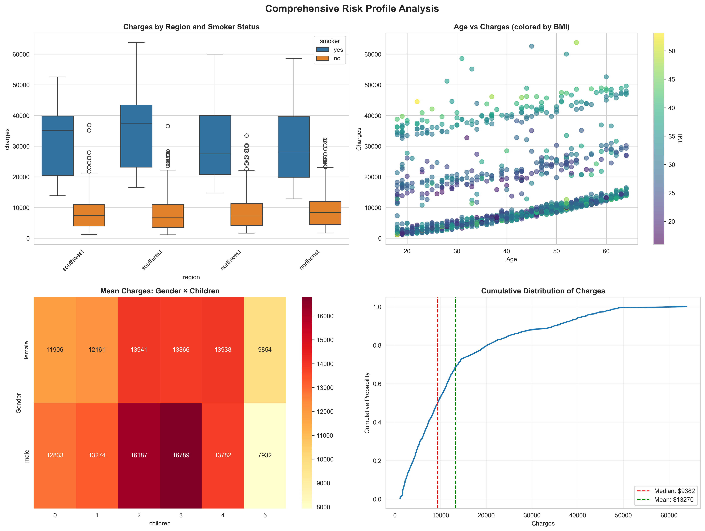
- **File**: `reports/figures/creative_viz1_risk_profile.png`
- **Description**: 4-panel dashboard showing charges by region and smoker status, age vs charges colored by BMI, gender × children heatmap, and cumulative distribution
- **Key Insight**: Clear interaction between geographic location, smoking status, and charges

**2. Demographic Risk Patterns**
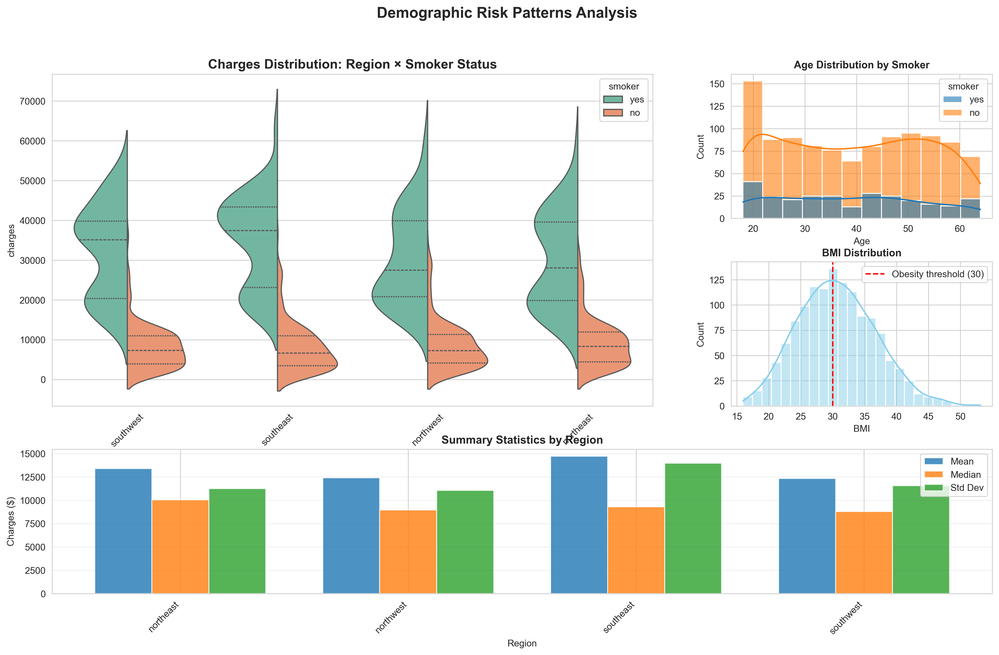
- **File**: `reports/figures/creative_viz2_demographic_patterns.png`
- **Description**: Multi-panel visualization with violin plots by region and smoker status, age distribution by smoker, BMI distribution, and summary statistics by region
- **Key Insight**: Smokers consistently show higher charge distributions across all regions

**3. Risk Segmentation Matrix**
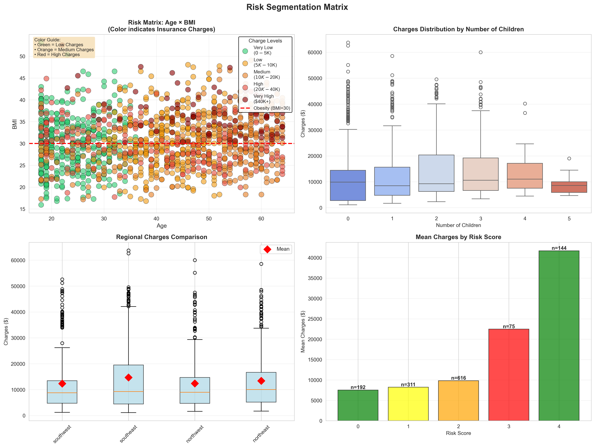
- **File**: `reports/figures/creative_viz3_risk_segmentation.png`
- **Description**: 4-panel matrix with Age × BMI scatter plot (discrete color bins), charges by number of children, regional comparison, and risk score analysis
- **Key Insight**: Clear visual risk segmentation with discrete color bins (Green=Low, Yellow=Medium, Orange=High, Red=Very High charges)

#### Supporting Visualizations

**Geographic Analysis**:
- 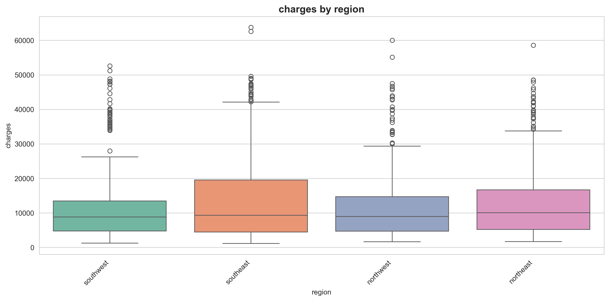 - Box plot showing charge distribution by region
- 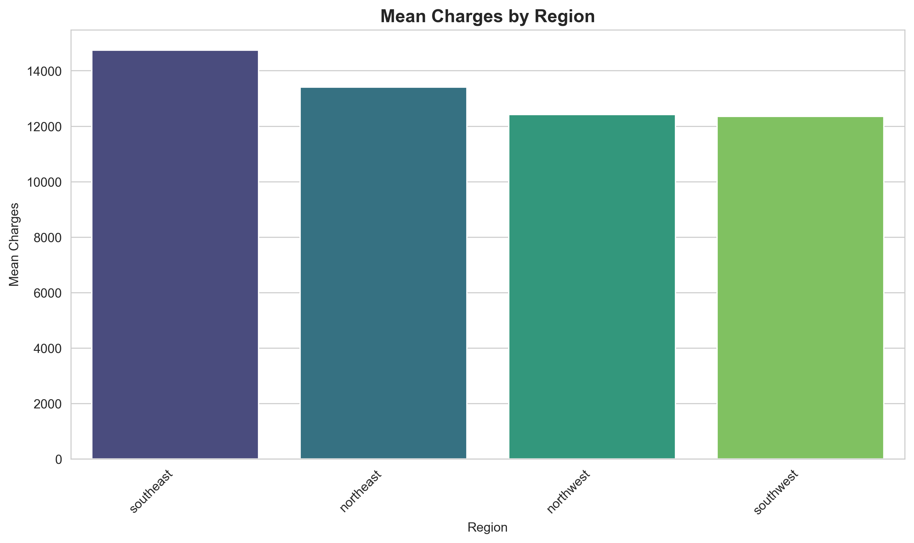 - Bar chart comparing mean charges across regions

**Demographic Analysis**:
- 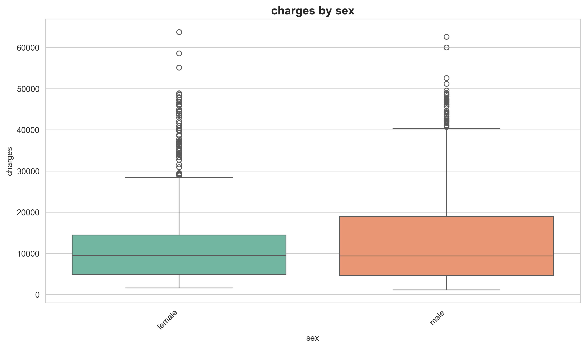 - Box plot comparing charges between genders

**Correlation Analysis**:
- 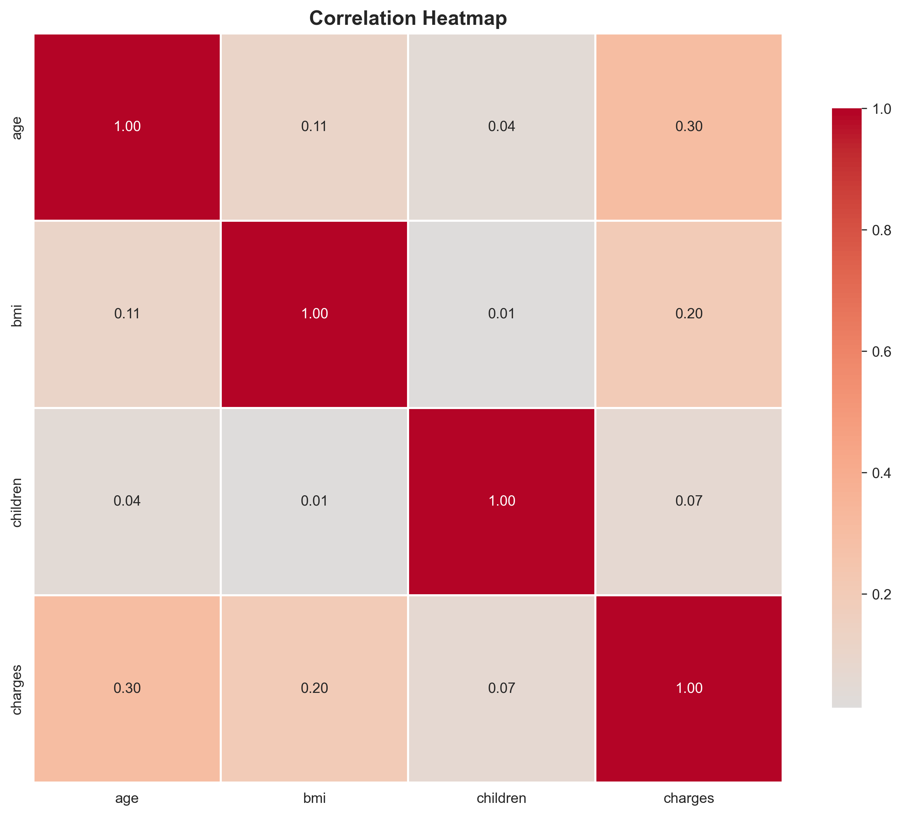 - Correlation matrix heatmap showing relationships between numerical variables

**Outlier Detection**:
- 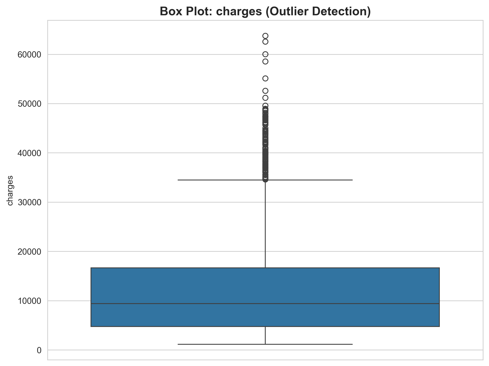 - Box plot identifying outliers in charges
- 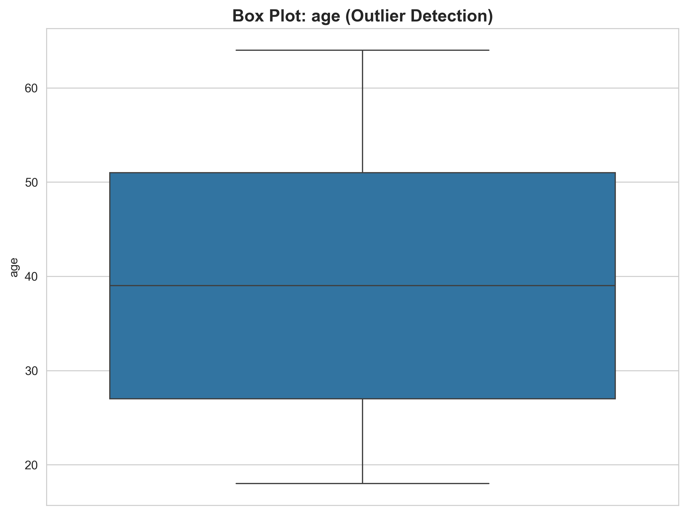 - Box plot for age distribution
- 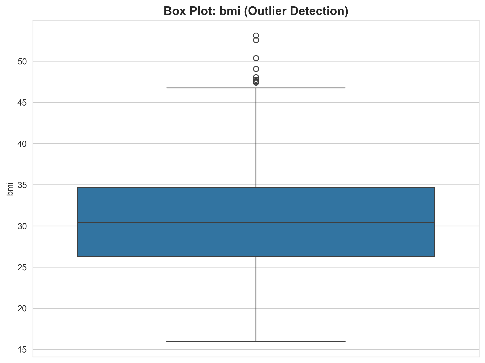 - Box plot for BMI distribution
- 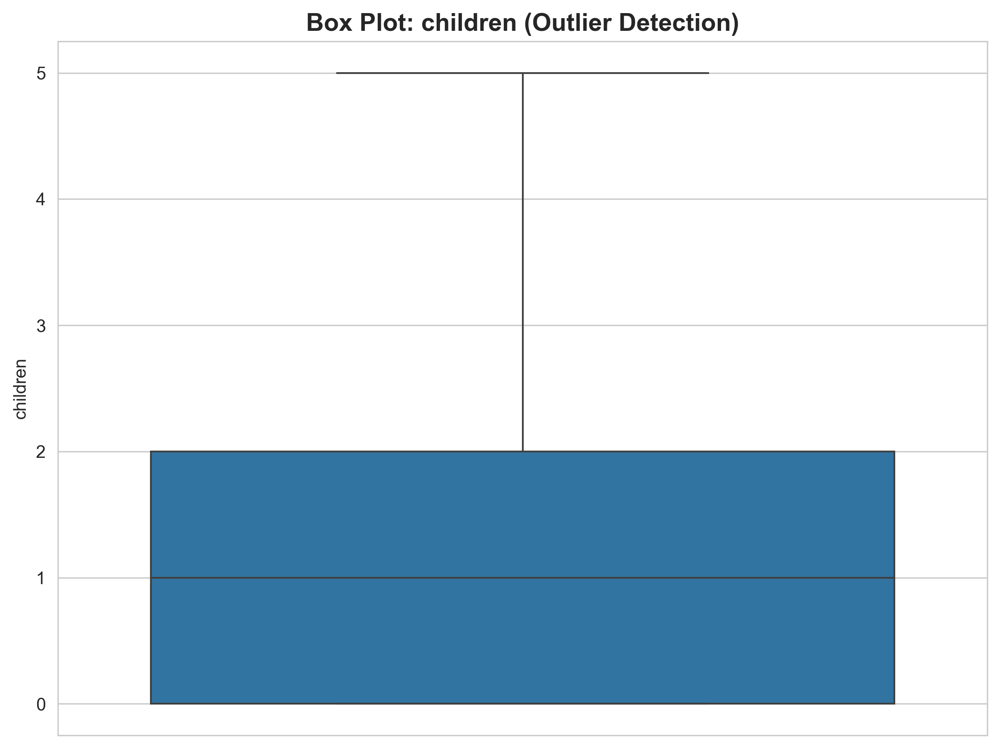 - Box plot for number of children

**All Visualization Files** (11 total):
1. `creative_viz1_risk_profile.png` - Comprehensive Risk Profile
2. `creative_viz2_demographic_patterns.png` - Demographic Risk Patterns
3. `creative_viz3_risk_segmentation.png` - Risk Segmentation Matrix
4. `charges_by_region.png` - Charges Distribution by Region
5. `charges_by_gender.png` - Charges Distribution by Gender
6. `mean_charges_by_region.png` - Mean Charges by Region
7. `correlation_heatmap.png` - Correlation Matrix
8. `outliers_charges.png` - Charges Outliers
9. `outliers_age.png` - Age Outliers
10. `outliers_bmi.png` - BMI Outliers
11. `outliers_children.png` - Children Outliers

**Location**: All visualizations are stored in `reports/figures/` directory and can be accessed via the GitHub repository.

### 1.3 Key EDA Findings

#### Risk Factors Identified

**High-Risk Segments**:
- Smokers (20.5% of population)
- Individuals with BMI > 30 (obesity threshold)
- Older individuals (age > 50)
- Southeast region residents

**Low-Risk Segments**:
- Non-smokers
- Normal BMI (< 25)
- Younger individuals (age < 30)
- Southwest region residents

#### Business Insights

1. **Geographic Variation**: Southeast region requires attention with 11% higher charges
2. **Demographic Patterns**: Males and older individuals show higher charges
3. **Behavioral Factors**: Smoking status is a major risk driver
4. **Distribution Characteristics**: Right-skewed distribution suggests most individuals have moderate charges, but a small group drives up the average

#### Statistical Rigor

- Appropriate statistical tests applied (Mann-Whitney U test)
- Distribution analysis completed (normality tests, skewness, kurtosis)
- Correlation analysis performed
- Outlier detection using IQR method

---

## 2. Task 2: Data Version Control (DVC)

### 2.1 DVC Setup and Configuration

#### Installation and Initialization
- **DVC Version**: 3.64.1
- **Installation**: Added to `requirements.txt` and installed
- **Initialization**: DVC repository initialized with `.dvc/` directory

#### Local Remote Storage Configuration
- **Storage Directory**: `dvc_storage/`
- **Remote Name**: `localstorage`
- **Remote Type**: Local filesystem
- **Status**: Configured as default remote

#### Data Versioning
- **Data File Tracked**: `data/raw/insurance.csv`
- **File Hash**: `d5364d06246fb4bfa4cc7d1ee89ebd0d`
- **File Size**: 55,628 bytes
- **DVC Metadata**: `data/raw/insurance.csv.dvc` (tracked by Git)
- **Status**: Successfully pushed to local storage

### 2.2 DVC Workflow Implementation

#### Files Created
- `.dvc/config` - DVC configuration
- `.dvc/.gitignore` - DVC cache ignore
- `.dvcignore` - DVC ignore patterns
- `data/raw/insurance.csv.dvc` - DVC metadata file
- `data/raw/.gitignore` - Excludes actual CSV from Git

#### Version Control Strategy
- **Git Tracks**: `.dvc` metadata files (small, versioned)
- **DVC Tracks**: Actual data files (large, stored separately)
- **Storage**: Data files stored in `dvc_storage/` (not in Git repository)
- **Reproducibility**: Exact data versions can be reproduced using `dvc pull`

### 2.3 Benefits Achieved

✅ **Reproducibility**: Exact data versions can be reproduced at any time  
✅ **Auditability**: Data changes are tracked and versioned for regulatory compliance  
✅ **Storage Efficiency**: Large data files not stored in Git repository  
✅ **Compliance**: Meets regulatory requirements for data versioning in finance/insurance  
✅ **Collaboration**: Team members can pull exact data versions for consistent analysis  

### 2.4 DVC Commands and Usage

**Key Commands Implemented**:
- `dvc init` - Initialize DVC repository
- `dvc remote add` - Configure storage remote
- `dvc add` - Add data files to DVC tracking
- `dvc push` - Push data to remote storage
- `dvc status` - Check data and pipeline status

**DVC Command Outputs (Evidence)**:

**1. DVC Initialization**:
```bash
$ python -m dvc init
Initialized DVC repository.

You can now commit the changes to git.
```

**2. Remote Storage Configuration**:
```bash
$ python -m dvc remote add -d localstorage ./dvc_storage
Setting 'localstorage' as a default remote.

$ python -m dvc remote list
localstorage    D:\kifyaAi\insurance-risk-analytics\dvc_storage (default)
```

**3. Adding Data to DVC**:
```bash
$ python -m dvc add data/raw/insurance.csv
100% Adding...|███████████████████████████████████████|1/1 [00:00, 11.82file/s]

To track the changes with git, run:
        git add 'data\raw\.gitignore' 'data\raw\insurance.csv.dvc'
```

**4. DVC Status Check**:
```bash
$ python -m dvc status
Data and pipelines are up to date.
```

**5. Pushing Data to Remote**:
```bash
$ python -m dvc push
Collecting                                           |1.00 [00:00,  590entry/s]
Pushing
1 file pushed
```

**6. DVC File Structure**:
The `.dvc` metadata file (`data/raw/insurance.csv.dvc`) contains:
```yaml
outs:
- md5: d5364d06246fb4bfa4cc7d1ee89ebd0d
  size: 55628
  hash: md5
  path: insurance.csv
```

**7. DVC Configuration** (`.dvc/config`):
```ini
[core]
    remote = localstorage
['remote "localstorage"']
    url = ../dvc_storage
```

**Workflow**:
1. Data files tracked by DVC (not Git)
2. `.dvc` metadata files tracked by Git
3. Data pushed to local storage
4. Team members can `dvc pull` to retrieve exact data versions

**Verification**:
- Data file exists in storage: `dvc_storage/files/md5/d5/364d06246fb4bfa4cc7d1ee89ebd0d`
- DVC metadata tracked in Git: `data/raw/insurance.csv.dvc`
- All DVC operations completed successfully

---

## 3. Project Structure and Deliverables

### 3.1 Repository Structure

```
insurance-risk-analytics/
├── .dvc/                    # DVC configuration
├── .github/workflows/       # CI/CD pipelines
├── data/
│   ├── raw/                 # Original data (tracked by DVC)
│   └── processed/           # Cleaned data
├── notebooks/
│   ├── 01_eda.ipynb         # EDA notebook
│   └── 02_preprocessing.ipynb
├── reports/
│   ├── figures/             # Visualization files (11 figures)
│   └── eda_report.md        # Comprehensive EDA report
├── src/
│   ├── data_loader.py       # Data loading utilities
│   ├── eda_utils.py         # Statistical analysis functions
│   └── visualization.py     # Plotting functions
├── tests/
├── dvc_storage/             # DVC local storage
├── requirements.txt
├── README.md
└── LICENSE
```

### 3.2 Key Deliverables

#### Code and Analysis
- ✅ Complete EDA notebook (`01_eda.ipynb`)
- ✅ Modular source code (`src/` directory)
- ✅ 11 visualization files
- ✅ 3 creative visualizations

#### Documentation
- ✅ Comprehensive README.md
- ✅ EDA Report (`reports/eda_report.md`)
- ✅ Task completion summaries
- ✅ Setup guides

#### Version Control
- ✅ Git repository with proper branching
- ✅ DVC setup for data versioning
- ✅ CI/CD pipeline configured

---

## 4. Technical Implementation

### 4.1 Technologies Used

- **Python**: 3.9+
- **Data Science**: pandas, numpy, scipy, scikit-learn
- **Visualization**: matplotlib, seaborn, plotly
- **Statistical Analysis**: scipy.stats, statsmodels
- **Version Control**: Git, DVC
- **CI/CD**: GitHub Actions

### 4.2 Code Quality

- **Formatting**: Black code formatter
- **Import Sorting**: isort
- **Linting**: flake8
- **Testing**: pytest framework configured
- **Documentation**: Comprehensive docstrings and comments

### 4.3 Best Practices

- ✅ Modular code structure
- ✅ Reusable functions
- ✅ Comprehensive error handling
- ✅ Type hints where applicable
- ✅ Clear variable naming
- ✅ Documentation standards

---

## 5. Key Insights and Recommendations

### 5.1 EDA Insights Summary

1. **Geographic Risk**: Southeast region shows 11% higher charges - requires targeted risk management
2. **Demographic Patterns**: Age and gender significantly impact charges
3. **Behavioral Factors**: Smoking status is a major risk driver
4. **Distribution**: Right-skewed distribution suggests need for separate high-risk segment analysis

### 5.2 Business Recommendations

1. **Premium Optimization**:
   - Consider higher premiums for Southeast region
   - Implement age-based pricing tiers
   - Adjust premiums based on BMI categories

2. **Marketing Strategy**:
   - Target low-risk segments (non-smokers, normal BMI, Southwest region) with competitive premiums
   - Develop wellness programs to reduce BMI-related risks
   - Focus on smoking cessation programs

3. **Risk Management**:
   - Monitor high-charge outliers (139 individuals, 10.39%)
   - Investigate factors driving Southeast region's higher charges
   - Develop predictive models using identified risk factors

### 5.3 Data Pipeline Recommendations

1. **Future Data Collection**:
   - Include temporal columns (TransactionMonth) for trend analysis
   - Add vehicle-specific columns if analyzing auto insurance
   - Consider more granular geographic data (PostalCode)

2. **Data Versioning**:
   - Continue using DVC for all data files
   - Document data changes in commit messages
   - Maintain data lineage for audit purposes

---

## 6. Next Steps

### Immediate Next Steps (Task 3)

1. **A/B Hypothesis Testing**:
   - Test risk differences across provinces
   - Test risk differences between zipcodes
   - Test margin differences between zip codes
   - Test risk differences between genders

2. **Machine Learning & Predictive Modeling**:
   - Linear regression models per zipcode
   - ML model for optimal premium prediction
   - Feature importance analysis
   - Model evaluation and validation

3. **Final Report**:
   - Comprehensive methodology documentation
   - Findings and recommendations
   - Plan features modification suggestions

---

## 7. Conclusion

This interim report demonstrates significant progress on the Insurance Risk Analytics project:

- ✅ **Task 1 Complete**: Comprehensive EDA with actionable insights
- ✅ **Task 2 Complete**: Reproducible data pipeline with DVC
- ✅ **Code Quality**: Professional codebase with CI/CD
- ✅ **Documentation**: Comprehensive documentation and reports

The project is on track for the final submission deadline (Tuesday, 09 Dec 2025, 8:00 PM UTC). The foundation has been established for advanced analytics, hypothesis testing, and predictive modeling in the next phase.

### Project Status

- **Current Phase**: Interim Submission (Tasks 1 & 2)
- **Next Phase**: Task 3 (A/B Testing & Machine Learning)
- **Overall Progress**: ~40% complete
- **On Track**: Yes

---

## Appendix

### A. GitHub Repository

**Main Branch Link**: [GitHub Repository - Main Branch](https://github.com/Leul4ever/insurance-risk-analytics)

**Key Branches**:
- `main` - Production branch with merged work
- `task-1` - EDA and statistics work
- `task-2` - DVC setup work

### B. Key Files and Locations

- **EDA Notebook**: `notebooks/01_eda.ipynb`
- **EDA Report**: `reports/eda_report.md`
- **Source Code**: `src/` directory
- **Visualizations**: `reports/figures/` (11 files)
- **DVC Config**: `.dvc/config`
- **CI/CD**: `.github/workflows/ci.yml`

### C. Statistics Summary

- **Total Commits**: 10+
- **Total Files**: 50+
- **Lines of Code**: 2,000+
- **Visualizations**: 11 (including 3 creative)
- **Documentation Pages**: 5+

---

**Report Prepared By**: Data Analytics Team  
**Date**: December 2025  
**Submission**: Interim Report - Tasks 1 & 2  
**Next Review**: Final Submission (09 Dec 2025)

---

*This report covers the interim submission requirements for Tasks 1 and 2. All work has been merged to the main branch and is available for review.*

